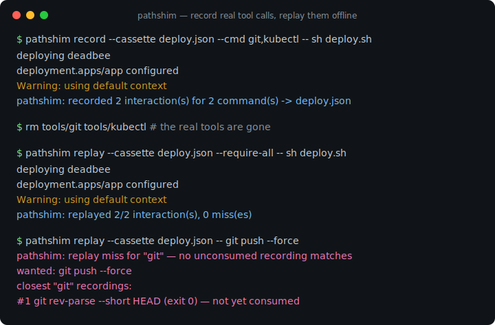
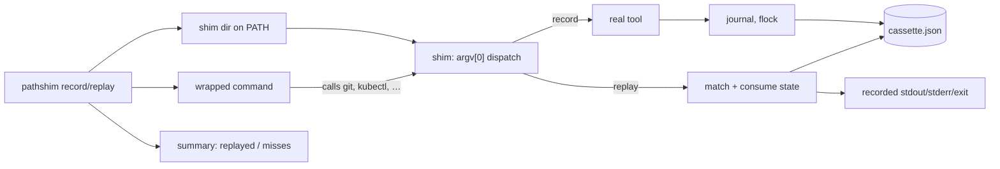

# pathshim

[English](README.md) | [中文](README.zh.md) | [日本語](README.ja.md)

[](LICENSE) [](go.mod) [](CHANGELOG.md)  [](CONTRIBUTING.md)

**pathshim：スクリプトが呼び出す外部コマンド——git、docker、kubectl、PATH 上のあらゆるツール——を記録し、テストでオフライン再生するオープンソースのゼロ依存 CLI。出力はバイト単位で一致、終了コードは本物、モックフレームワーク不要。**



```bash
git clone https://github.com/JaydenCJ/pathshim && cd pathshim
go build -o pathshim ./cmd/pathshim    # single static binary, stdlib only
```

> プレリリース：v0.1.0 はまだパッケージレジストリに公開されていません。上記の手順でソースからビルドしてください（Go ≥1.22、Linux/macOS——shim はシンボリックリンクのため Windows は対象外）。

## なぜ pathshim？

`git`、`docker`、`kubectl` を呼び出すスクリプトのテストは苦行です：本物のツールは遅く、認証情報やデーモンを要求し、状態を書き換えるため、多くのチームはテスト自体を諦めるか、ツールごと・ケースごとに壊れやすいモックスクリプトを手書きしています。言語レベルのリプレイライブラリは役に立ちません——それらは単一ランタイム内の関数呼び出しを傍受しますが、デプロイスクリプトが越えるのは*プロセス*境界だからです。pathshim はまさにその境界で動きます：`pathshim record` は shim ディレクトリを PATH の先頭に置き、本物のツールを一度だけ実行させ、各呼び出し——argv、消費された stdin、stdout、stderr、終了コード——をレビュー可能な JSON カセットに記録します。`pathshim replay` は同じ呼び出しに完全にカセットだけで応答するため、git も docker デーモンもネットワークもないマシンでテストが通り、記録していないものをスクリプトが呼び始めた瞬間に（最も近い記録候補を添えて）大きな声で失敗します。境界がプロセスそのものなので、bash、Python、Go、Make——コマンドを spawn するあらゆる言語のテストで使えます。

| | pathshim | 手書きモックスクリプト | bats-mock 系スタブ | VCR 系 HTTP リプレイ | agent-vcr |
|---|---|---|---|---|---|
| 実挙動を自動で記録 | ✅ | ❌ 手書き | ❌ 手書き | ✅ HTTP のみ | ✅ ツール呼び出し |
| どの言語のテストでも使える | ✅ プロセス境界 | ✅ | ❌ bats/bash | ❌ 言語別ライブラリ | ❌ Python エージェント |
| stderr + 終了コード + バイナリ stdout を再生 | ✅ | 部分的 | 終了コード/出力のみ | ❌ HTTP ボディ | ❌ ツール結果 |
| ミス時に最近傍候補を診断表示 | ✅ | ❌ | ❌ | 実装次第 | ✅ |
| 記録時のシークレット墨消し | ✅ `--redact` | ❌ | ❌ | ✅ | ✅ |
| 並列安全（`make -j`、`&`） | ✅ flock | ❌ | ❌ | 対象外 | 対象外 |
| ランタイム依存 | 0 | 0 | bats | 言語別 | Python |

<sub>スコープ確認（2026-07-13）：agent-vcr は Python プロセス内の AI エージェントのツール呼び出しを記録し、pathshim は OS のプロセス境界を越える任意の実行ファイルを記録します——両者は競合ではなく補完関係です。</sub>

## 特長

- **一度記録すれば、どこでも再生** — 1 回の記録セッションで shim された全呼び出し（argv、消費された stdin、stdout、stderr、終了コード）を整形済み JSON カセットに収め、テストの隣にコミットできます。
- **本当のオフライン再生** — 再生に必要なのはカセットだけ：本物のツールをアンインストールしても、テストはバイト単位で一致するストリームと元の終了コード（`128+signal` のシグナル死を含む）を受け取ります。
- **ミスは証拠付きで大声で失敗** — 未記録の呼び出しは特徴的な終了コード 51 で終わり、最も近い記録（消費済みかどうかも）を表示します。スクリプトがエラーを握り潰しても親セッションは失敗します。
- **3 つのミスポリシー** — 密閉テスト向けの `fail`（デフォルト）、未カバーの呼び出しだけ本物へ流すハイブリッド運用の `passthrough`、どうでもいいノイズ向けの `empty`。どのポリシーでもミスは必ずサマリに計上され、セッションは終了コード 1 で終わるため、隙間が黙って通過することはありません。
- **厳密さのダイヤル** — `--ordered` は記録どおりの呼び出し順を強制、`--match-stdin` はパイプの中身で、`--match-env` は記録済み環境変数で呼び出しを区別、`--require-all` は未使用の記録が残ると失敗します。
- **コミットして安全なカセット** — `--redact REGEX` がディスクに触れる前にシークレットを消し、バイナリ/ANSI 出力は base64 で箱詰めされ "text" に紛れ込まず、`pathshim verify` が CI なしのパイプラインでカセットの整合性を検査します。
- **ゼロ依存・完全オフライン** — Go 標準ライブラリのみ。shim は pathshim バイナリ自身へのシンボリックリンクです。テレメトリもネットワークも一切ありません。

## クイックスタート

```bash
# a deploy script that calls two external tools
cat deploy.sh
#   sha="$(git rev-parse --short HEAD)"
#   echo "deploying $sha"
#   printf 'kind: Deployment\n' | kubectl apply -f -

pathshim record --cassette deploy.json --cmd git,kubectl -- sh deploy.sh
```

実際にキャプチャした出力：

```text
deploying deadbee
deployment.apps/app configured
Warning: using default context
pathshim: recorded 2 interaction(s) for 2 command(s) -> deploy.json
```

次に再生——git と kubectl は PATH から完全に削除済みです（実出力）：

```text
$ pathshim replay --cassette deploy.json --require-all -- sh deploy.sh
deploying deadbee
deployment.apps/app configured
Warning: using default context
pathshim: replayed 2/2 interaction(s), 0 miss(es)
```

スクリプトが記録から逸れると、ミスが何が起きたかを正確に伝えます（実出力、終了コード 51）：

```text
$ pathshim replay --cassette deploy.json -- git push --force
pathshim: replay miss for "git" — no unconsumed recording matches
  wanted: git push --force
  closest "git" recordings:
    #1 git rev-parse --short HEAD (exit 0) — not yet consumed
pathshim: replayed 0/2 interaction(s), 1 miss(es)
pathshim: miss (fail): git push --force
```

## 記録とマッチング

再生は各ライブ呼び出しを `command` + 完全一致の `args` で未消費の記録と突き合わせ、各記録を先頭から一度ずつ消費します。以下のダイヤルでその厳密さを調整できます。カセット自体の仕様は [docs/cassette-format.md](docs/cassette-format.md) を参照。

| フラグ | デフォルト | 効果 |
|---|---|---|
| `--cmd NAME`（record） | 必須 | shim するコマンド。繰り返し指定・カンマ区切り可 |
| `--redact REGEX`（record） | — | 記録ストリーム内のマッチを `[REDACTED]` に置換（繰り返し可） |
| `--env KEY`（record） | — | 各インタラクションで環境変数を記録（繰り返し可） |
| `--max-capture N`（record） | `1048576` | ストリームごとの記録上限（バイト）。ストリーム自体は全量通過 |
| `--ordered`（replay） | オフ | 呼び出しは記録どおりの順序で到着しなければならない |
| `--match-stdin`（replay） | オフ | 排出した stdin が記録された stdin と一致すること |
| `--match-env`（replay） | オフ | 記録された環境変数がライブでも同じ値であること |
| `--on-miss`（replay） | `fail` | `fail`（終了 51）、`passthrough`（本物を実行）、`empty`（無言で終了 0） |
| `--require-all`（replay） | オフ | 再生されなかった記録が 1 つでもあれば失敗 |

終了コード：record/replay はラップしたコマンドのコードを透過。それ以外は 0 成功、1 再生ギャップ（ミスまたは `--require-all` 不足）、2 使い方エラー、3 内部/shim 障害、51 `fail` ポリシー下の shim レベルのミス。

## 検証

このリポジトリに CI はありません。上記の主張はすべてローカル実行で検証されます：

```bash
go test ./...            # 90 deterministic tests, offline, < 10 s
bash scripts/smoke.sh    # end-to-end record→replay check, prints SMOKE OK
```

## アーキテクチャ



## ロードマップ

- [x] v0.1.0 — PATH-shim 記録/再生エンジン、墨消しとバイナリ安全ボディを備えた JSON カセット、順序/stdin/env マッチング、3 つのミスポリシー、inspect/verify ツール、90 テスト + smoke スクリプト
- [ ] カセット内の引数マッチャー（`"args": ["push", "*"]`）による寛容な再生
- [ ] 記録済みインタラクションの結合・切り詰め・再墨消しを行う `pathshim edit`
- [ ] タイムアウトテスト向けに `duration_ms` を再現するレイテンシシミュレーション（任意）
- [ ] 複数回の実行にまたがってスイートを記録するカセットマージ
- [ ] シンボリックリンクの代わりに `.cmd` shim ファイルを使う Windows 対応

全リストは [open issues](https://github.com/JaydenCJ/pathshim/issues) を参照。

## コントリビュート

Issue・ディスカッション・PR を歓迎します。ローカルのワークフロー（フォーマット、vet、テスト、`SMOKE OK`）は [CONTRIBUTING.md](CONTRIBUTING.md) を参照。入門タスクは [good first issue](https://github.com/JaydenCJ/pathshim/issues?q=is%3Aissue+is%3Aopen+label%3A%22good+first+issue%22) ラベル、設計の議論は [Discussions](https://github.com/JaydenCJ/pathshim/discussions) へ。

## ライセンス

[MIT](LICENSE)
