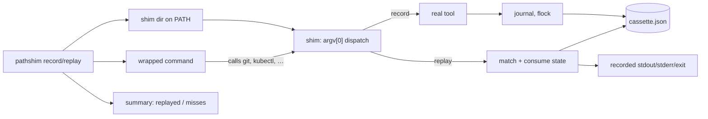

# pathshim

[English](README.md) | [中文](README.zh.md) | [日本語](README.ja.md)

[](LICENSE) [](go.mod) [](CHANGELOG.md)  [](CONTRIBUTING.md)

**pathshim：an open-source, zero-dependency CLI that records the external commands your scripts run — git, docker, kubectl, anything on PATH — and replays them offline in tests: byte-identical output, real exit codes, no mock frameworks.**


```bash
git clone https://github.com/JaydenCJ/pathshim && cd pathshim
go build -o pathshim ./cmd/pathshim    # single static binary, stdlib only
```

> Pre-release: v0.1.0 is not tagged on a package registry yet; build from source as above (any Go ≥1.22, Linux/macOS — shims are symlinks, so Windows is out of scope).

## Why pathshim?

Testing a script that shells out to `git`, `docker`, or `kubectl` is miserable: the real tools are slow, need credentials and daemons, and mutate state, so most teams either skip those tests or hand-write brittle mock scripts per tool per case. Language-level replay libraries don't help — they intercept function calls inside one runtime, while your deploy script crosses a *process* boundary. pathshim works at that boundary: `pathshim record` prepends a directory of shims to PATH, lets the real tools run once, and captures every invocation — argv, consumed stdin, stdout, stderr, exit code — into a reviewable JSON cassette. `pathshim replay` then answers the same calls entirely from the cassette, so the test passes on a machine with no git, no docker daemon, and no network, and fails loudly (with the closest recorded candidates) the moment your script starts calling something you never recorded. Because the boundary is the process, it works for tests written in bash, Python, Go, Make — any language that spawns commands.

| | pathshim | hand-rolled mock scripts | bats-mock style stubs | VCR-style HTTP replay | agent-vcr |
|---|---|---|---|---|---|
| Records real behavior automatically | ✅ | ❌ hand-written | ❌ hand-written | ✅ HTTP only | ✅ tool calls |
| Works for any language's tests | ✅ process boundary | ✅ | ❌ bats/bash | ❌ per-language lib | ❌ Python agents |
| Replays stderr + exit codes + binary stdout | ✅ | partial | exit/output only | ❌ HTTP bodies | ❌ tool results |
| Miss diagnosis with closest candidates | ✅ | ❌ | ❌ | varies | ✅ |
| Secret redaction at record time | ✅ `--redact` | ❌ | ❌ | ✅ | ✅ |
| Parallel-safe (`make -j`, `&`) | ✅ flock | ❌ | ❌ | n/a | n/a |
| Runtime dependencies | 0 | 0 | bats | per-language | Python |

<sub>Scope check 2026-07-13: agent-vcr records AI-agent tool calls inside a Python process; pathshim records any executable crossing the OS process boundary — the two compose rather than compete.</sub>

## Features

- **Record once, replay anywhere** — one recording session captures every shimmed call (argv, stdin as consumed, stdout, stderr, exit code) into a pretty-printed JSON cassette you commit next to the test.
- **Truly offline replay** — replay needs only the cassette: the real tools can be uninstalled, and the test still sees byte-identical streams and the original exit codes, including `128+signal` deaths.
- **Misses fail loudly, with receipts** — an unrecorded call exits with a distinctive code 51 and prints the closest recordings (and whether they were already consumed); the parent session fails even if the script swallowed the error.
- **Three miss policies** — `fail` (default) for hermetic tests, `passthrough` for hybrid runs that hit the live tool for uncovered calls, `empty` for don't-care noise; whatever the policy, every miss lands in the summary and the session exits 1, so gaps never pass silently.
- **Strictness dials** — `--ordered` enforces the recorded call sequence, `--match-stdin` distinguishes calls by piped payload, `--match-env` by recorded environment variables, `--require-all` fails when recordings go unused.
- **Cassettes safe to commit** — `--redact REGEX` scrubs secrets before they touch disk, binary/ANSI output is base64-boxed so nothing hides in "text", and `pathshim verify` checks a cassette's integrity in CI-less pipelines.
- **Zero dependencies, fully offline** — Go standard library only; shims are symlinks to the pathshim binary itself. No telemetry, no network, ever.

## Quickstart

```bash
# a deploy script that calls two external tools
cat deploy.sh
#   sha="$(git rev-parse --short HEAD)"
#   echo "deploying $sha"
#   printf 'kind: Deployment\n' | kubectl apply -f -

pathshim record --cassette deploy.json --cmd git,kubectl -- sh deploy.sh
```

Real captured output:

```text
deploying deadbee
deployment.apps/app configured
Warning: using default context
pathshim: recorded 2 interaction(s) for 2 command(s) -> deploy.json
```

Now replay it — with git and kubectl deleted from PATH entirely (real output):

```text
$ pathshim replay --cassette deploy.json --require-all -- sh deploy.sh
deploying deadbee
deployment.apps/app configured
Warning: using default context
pathshim: replayed 2/2 interaction(s), 0 miss(es)
```

When the script drifts from the recording, the miss says exactly what happened (real output, exit code 51):

```text
$ pathshim replay --cassette deploy.json -- git push --force
pathshim: replay miss for "git" — no unconsumed recording matches
  wanted: git push --force
  closest "git" recordings:
    #1 git rev-parse --short HEAD (exit 0) — not yet consumed
pathshim: replayed 0/2 interaction(s), 1 miss(es)
pathshim: miss (fail): git push --force
```

## Recording and matching

Replay matches each live call against unconsumed recordings by `command` + exact `args`, consuming each recording once, earliest first. The dials below tighten or loosen that; the cassette itself is documented in [docs/cassette-format.md](docs/cassette-format.md).

| Flag | Default | Effect |
|---|---|---|
| `--cmd NAME` (record) | required | command to shim; repeatable or comma-separated |
| `--redact REGEX` (record) | — | replace matches with `[REDACTED]` in recorded streams (repeatable) |
| `--env KEY` (record) | — | capture an environment variable per interaction (repeatable) |
| `--max-capture N` (record) | `1048576` | per-stream recording cap in bytes; streams still flow through in full |
| `--ordered` (replay) | off | calls must arrive in exactly the recorded order |
| `--match-stdin` (replay) | off | drained stdin must equal the recorded stdin |
| `--match-env` (replay) | off | recorded env vars must have the same values live |
| `--on-miss` (replay) | `fail` | `fail` (exit 51), `passthrough` (run the real tool), or `empty` (exit 0, silent) |
| `--require-all` (replay) | off | fail unless every recorded interaction was replayed |

Exit codes: record/replay propagate the wrapped command's code; otherwise 0 ok, 1 replay gap (miss or `--require-all` shortfall), 2 usage error, 3 internal/shim failure, 51 shim-level miss under `fail`.

## Verification

This repository ships no CI; every claim above is verified by local runs:

```bash
go test ./...            # 90 deterministic tests, offline, < 10 s
bash scripts/smoke.sh    # end-to-end record→replay check, prints SMOKE OK
```

## Architecture



## Roadmap

- [x] v0.1.0 — PATH-shim record/replay engine, JSON cassettes with redaction and binary-safe bodies, ordered/stdin/env matching, three miss policies, inspect/verify tooling, 90 tests + smoke script
- [ ] Argument matchers in cassettes (`"args": ["push", "*"]`) for tolerant replays
- [ ] `pathshim edit` to splice, trim, and re-redact recorded interactions
- [ ] Optional latency simulation replaying `duration_ms` for timeout testing
- [ ] Cassette merge for recording a suite across multiple runs
- [ ] Windows support via `.cmd` shim files instead of symlinks

See the [open issues](https://github.com/JaydenCJ/pathshim/issues) for the full list.

## Contributing

Issues, discussions and pull requests are welcome — see [CONTRIBUTING.md](CONTRIBUTING.md) for the local workflow (format, vet, tests, `SMOKE OK`). Good entry points are labelled [good first issue](https://github.com/JaydenCJ/pathshim/issues?q=is%3Aissue+is%3Aopen+label%3A%22good+first+issue%22), and design questions live in [Discussions](https://github.com/JaydenCJ/pathshim/discussions).

## License

[MIT](LICENSE)
