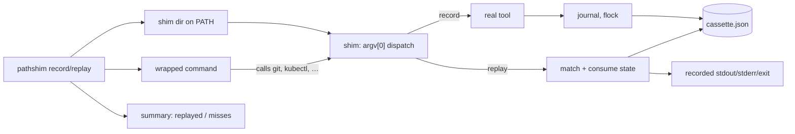

# pathshim

[English](README.md) | [中文](README.zh.md) | [日本語](README.ja.md)

[](LICENSE) [](go.mod) [](CHANGELOG.md)  [](CONTRIBUTING.md)

**pathshim：开源、零依赖的 CLI，录制脚本调用的外部命令——git、docker、kubectl，PATH 上的任何工具——并在测试中离线回放：输出逐字节一致、退出码真实，无需任何 mock 框架。**


```bash
git clone https://github.com/JaydenCJ/pathshim && cd pathshim
go build -o pathshim ./cmd/pathshim    # single static binary, stdlib only
```

> 预发布说明：v0.1.0 尚未发布到任何包仓库；请按上述方式从源码构建（Go ≥1.22，Linux/macOS——shim 基于符号链接，Windows 不在范围内）。

## 为什么选 pathshim？

测试一个会调用 `git`、`docker` 或 `kubectl` 的脚本非常痛苦：真实工具慢、需要凭证和守护进程、还会改动状态，所以多数团队要么干脆不测，要么为每个工具每个用例手写脆弱的 mock 脚本。语言级的回放库帮不上忙——它们拦截的是单个运行时内部的函数调用，而你的部署脚本跨越的是*进程*边界。pathshim 正工作在这条边界上：`pathshim record` 把一个 shim 目录前置到 PATH，让真实工具跑一次，并把每次调用——argv、被消费的 stdin、stdout、stderr、退出码——捕获进一份可审阅的 JSON 磁带（cassette）。随后 `pathshim replay` 完全用磁带回答同样的调用，于是测试在一台没有 git、没有 docker 守护进程、没有网络的机器上照样通过；而一旦脚本开始调用你从未录制过的东西，它会大声失败（并列出最接近的已录制候选）。因为边界是进程本身，bash、Python、Go、Make——任何会派生命令的语言写的测试都能用。

| | pathshim | 手写 mock 脚本 | bats-mock 式桩 | VCR 式 HTTP 回放 | agent-vcr |
|---|---|---|---|---|---|
| 自动录制真实行为 | ✅ | ❌ 手工编写 | ❌ 手工编写 | ✅ 仅 HTTP | ✅ 工具调用 |
| 适用于任何语言的测试 | ✅ 进程边界 | ✅ | ❌ bats/bash | ❌ 按语言的库 | ❌ Python 智能体 |
| 回放 stderr + 退出码 + 二进制 stdout | ✅ | 部分 | 仅退出码/输出 | ❌ HTTP 报文 | ❌ 工具结果 |
| 未命中时给出最接近候选的诊断 | ✅ | ❌ | ❌ | 视实现 | ✅ |
| 录制时脱敏 | ✅ `--redact` | ❌ | ❌ | ✅ | ✅ |
| 并行安全（`make -j`、`&`） | ✅ flock | ❌ | ❌ | 不适用 | 不适用 |
| 运行时依赖 | 0 | 0 | bats | 按语言 | Python |

<sub>范围核对（2026-07-13）：agent-vcr 录制的是 Python 进程内 AI 智能体的工具调用；pathshim 录制的是跨越操作系统进程边界的任意可执行文件——两者是互补而非竞争。</sub>

## 特性

- **录一次，处处回放** — 一次录制会话把每个被 shim 的调用（argv、被消费的 stdin、stdout、stderr、退出码）捕获进一份格式化的 JSON 磁带，直接提交到测试旁边。
- **真正的离线回放** — 回放只需要磁带：真实工具可以整个卸载，测试依然看到逐字节一致的流和原始退出码，包括 `128+signal` 的信号死亡。
- **未命中大声失败，且有凭据** — 未录制的调用以独特的退出码 51 结束，并打印最接近的录制（以及它们是否已被消费）；即使脚本吞掉了错误，父会话也会失败。
- **三种未命中策略** — `fail`（默认）用于封闭测试，`passthrough` 用于混合运行（未覆盖的调用打到真实工具），`empty` 用于无关噪音；无论哪种策略，每次未命中都会计入总结且会话以退出码 1 结束，缺口绝不会悄悄溜过。
- **可调的严格度** — `--ordered` 强制按录制顺序调用，`--match-stdin` 按管道载荷区分调用，`--match-env` 按录制的环境变量区分，`--require-all` 在有录制未被使用时失败。
- **可放心提交的磁带** — `--redact REGEX` 在落盘前抹掉机密，二进制/ANSI 输出以 base64 封装、不会藏在 "text" 里，`pathshim verify` 在无 CI 的流水线中校验磁带完整性。
- **零依赖、完全离线** — 仅用 Go 标准库；shim 就是指向 pathshim 二进制自身的符号链接。永远没有遥测、没有网络。

## 快速上手

```bash
# a deploy script that calls two external tools
cat deploy.sh
#   sha="$(git rev-parse --short HEAD)"
#   echo "deploying $sha"
#   printf 'kind: Deployment\n' | kubectl apply -f -

pathshim record --cassette deploy.json --cmd git,kubectl -- sh deploy.sh
```

真实捕获的输出：

```text
deploying deadbee
deployment.apps/app configured
Warning: using default context
pathshim: recorded 2 interaction(s) for 2 command(s) -> deploy.json
```

现在回放——git 和 kubectl 已从 PATH 上彻底删除（真实输出）：

```text
$ pathshim replay --cassette deploy.json --require-all -- sh deploy.sh
deploying deadbee
deployment.apps/app configured
Warning: using default context
pathshim: replayed 2/2 interaction(s), 0 miss(es)
```

当脚本偏离录制时，未命中会说清到底发生了什么（真实输出，退出码 51）：

```text
$ pathshim replay --cassette deploy.json -- git push --force
pathshim: replay miss for "git" — no unconsumed recording matches
  wanted: git push --force
  closest "git" recordings:
    #1 git rev-parse --short HEAD (exit 0) — not yet consumed
pathshim: replayed 0/2 interaction(s), 1 miss(es)
pathshim: miss (fail): git push --force
```

## 录制与匹配

回放按 `command` + 精确 `args` 把每个实时调用与未消费的录制配对，每条录制只消费一次、先到先得。下面的开关可收紧或放宽这一规则；磁带本身的格式见 [docs/cassette-format.md](docs/cassette-format.md)。

| 参数 | 默认 | 效果 |
|---|---|---|
| `--cmd NAME`（record） | 必填 | 要 shim 的命令；可重复或逗号分隔 |
| `--redact REGEX`（record） | — | 在录制流中把匹配替换为 `[REDACTED]`（可重复） |
| `--env KEY`（record） | — | 每次交互捕获一个环境变量（可重复） |
| `--max-capture N`（record） | `1048576` | 每条流的录制上限（字节）；流本身仍完整通过 |
| `--ordered`（replay） | 关 | 调用必须严格按录制顺序到达 |
| `--match-stdin`（replay） | 关 | 排空的 stdin 必须与录制的 stdin 相等 |
| `--match-env`（replay） | 关 | 录制的环境变量必须与现场取值一致 |
| `--on-miss`（replay） | `fail` | `fail`（退出 51）、`passthrough`（运行真实工具）或 `empty`（静默退出 0） |
| `--require-all`（replay） | 关 | 有任何录制未被回放即失败 |

退出码：record/replay 透传被包裹命令的退出码；其余情况 0 成功，1 回放缺口（未命中或 `--require-all` 不足），2 用法错误，3 内部/shim 故障，51 `fail` 策略下 shim 级未命中。

## 验证

本仓库不附带 CI；上面每一条主张都由本地运行验证：

```bash
go test ./...            # 90 deterministic tests, offline, < 10 s
bash scripts/smoke.sh    # end-to-end record→replay check, prints SMOKE OK
```

## 架构



## 路线图

- [x] v0.1.0 — PATH-shim 录制/回放引擎、带脱敏与二进制安全体的 JSON 磁带、顺序/stdin/env 匹配、三种未命中策略、inspect/verify 工具、90 个测试 + smoke 脚本
- [ ] 磁带内的参数匹配器（`"args": ["push", "*"]`），实现宽容回放
- [ ] `pathshim edit`：拼接、裁剪、重新脱敏已录制的交互
- [ ] 可选的延迟模拟：回放 `duration_ms` 用于超时测试
- [ ] 磁带合并：跨多次运行录制同一套件
- [ ] Windows 支持：用 `.cmd` shim 文件代替符号链接

完整列表见 [open issues](https://github.com/JaydenCJ/pathshim/issues)。

## 参与贡献

欢迎 issue、讨论与 PR——本地工作流（格式化、vet、测试、`SMOKE OK`）见 [CONTRIBUTING.md](CONTRIBUTING.md)。入门任务见 [good first issue](https://github.com/JaydenCJ/pathshim/issues?q=is%3Aissue+is%3Aopen+label%3A%22good+first+issue%22) 标签，设计问题请到 [Discussions](https://github.com/JaydenCJ/pathshim/discussions)。

## 许可证

[MIT](LICENSE)
